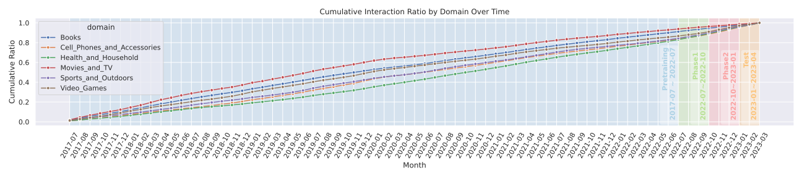

# MMGRid: Navigating Temporal-aware and Cross-domain Generative Recommendation via Model Merging

<p align="center" width="60%">
    <kbd> </kbd>
</p>

<a href="https://huggingface.co/MMGRid/MMGRid"></a>

**MMGRid** is the official implementation of the paper *"MMGRid: Navigating Temporal-aware and Cross-domain Generative Recommendation via Model Merging"*. This framework provides a structured contextual grid of Generative Recommendation (GR) checkpoints for studying model merging across temporal evolution and domain diversity.

## 🌟 Overview

Model merging (MM) offers an efficient mechanism for integrating multiple specialized models without retraining. MMGRid introduces:
- **Unified Framework**: A structured grid of GR checkpoints across domains and temporal stages.
- **Three GR Paradigms**: Text-grounded generation, Semantic ID modeling, and Semantic embedding modeling.
- **Advanced Merging Algorithms**: Support for Weight Averaging (WA), TIES-Merging, Task Arithmetic, and our proposed Mask Merging.
- **Contextual Insights**: Systematic study of parameter conflicts and recency bias in generative recommendation.

---

## 🛠️ Requirements

### Environment Setup
We recommend using Conda to manage the environment:

```bash
conda create -n mmgrid python=3.10
conda activate mmgrid
pip install -r requirements.txt
```

The key dependencies are:
- **Training**: [torchtune](https://github.com/pytorch/torchtune)
- **Inference**: [vLLM](https://github.com/vllm-project/vllm)
- **Base Model**: [Qwen3-0.6B](https://huggingface.co/Qwen/Qwen3-0.6B) (or other homologous LLMs)


### Key Dependencies
- **Training**: [torchtune](https://github.com/pytorch/torchtune)
- **Inference**: [vLLM](https://github.com/vllm-project/vllm)
- **Base Model**: [Qwen3-0.6B](https://huggingface.co/Qwen/Qwen3-0.6B) (or other homologous LLMs)

### Types of Models
We implement the following different types of Generative Recommendation models:
- **Text-grounded**: [BIGRec](https://dl.acm.org/doi/full/10.1145/3716393)
- **Semantic ID**: [LC-Rec](https://ieeexplore.ieee.org/abstract/document/10597986/)
- **Semantic embedding**: [HLLM](https://arxiv.org/abs/2409.12740)

> All models are sharing the same base model [Qwen3-0.6B](https://huggingface.co/Qwen/Qwen3-0.6B), with following adaptions:
> - LC-Rec: the vocabulary is expanded to add additional tokens for item codes.
>- HLLM: The item LLM in HLLM is initialized from Qwen3-0.6B, and the user LLM is initialized from the first and last layers of Qwen3-0.6B, following the practice mentioned in [HLLM](https://arxiv.org/abs/2409.12740) paper.
---

### Dataset
We use the Amazon datasets (2023)for the experiments. The datasets are available in the [Amazon datasets](https://amazon-reviews-2023.github.io/) page. Specifically, we use the following category data as diverse domains for merging experiments:
- **Movies and TV**: Movies_and_TV
- **Video Games**: Video_Games
- **Books**: Books
- **Sports and Outdoors**: Sports_and_Outdoors
- **Cell Phones and Accessories**: Cell_Phones_and_Accessories
- **Health and Household**: Health_and_Household

All domains are preprocessed and split into different phases:
- Pretrain: 2017-07-01 ~ 2022-06-30
- Phase1: 2022-07-01 ~ 2022-09-30
- Phase2: 2022-10-01 ~ 2022-12-31
- Test: 2023-01-01 ~ 2023-04-01


| Domain                             	| # Users 	| # Items 	| # Pretrain 	| # Phase1 	| # Phase 2 	|  # Test 	|
|------------------------------------	|:-------:	|:-------:	|:----------:	|:--------:	|:---------:	|:-------:	|
| Video Games (Vid.)                 	|   4,876 	|   4,068 	|    215,761 	|    9,365 	|    14,708 	|  12,228 	|
| Movies and TV (Mov.)               	|   5,289 	|  10,138 	|    617,122 	|   17,732 	|    14,804 	|  14,669 	|
| Cell Phones and Accessories (Cel.) 	|  39,262 	|  19,868 	|  1,211,712 	|   63,152 	|    97,097 	| 100,437 	|
| Sports and Outdoors (Spo.)         	|  34,571 	|  30,506 	|  1,468,421 	|   87,015 	|   113,283 	| 102,969 	|
| Books (Boo.)                       	|  38,418 	|  34,642 	|  2,578,864 	|  100,263 	|    90,801 	|  95,406 	|
| Health and Household (Hea.)        	| 113,393 	|  57,727 	|  3,692,658 	|  252,223 	|   304,222 	| 290,457 	|


The distribution of interactions across domains and temporal phases is shown below:



## 🚀 Usage

> To run the scripts, you need to set the following environment variables:
> - DATA_DIR: path to the data directory
> - MODEL_ZOO_PATH: path to the pretrained model (e.g., Qwen3-0.6B) directory
> - CKPT_PATH: path to the checkpoint directory

### 1. Preprocessing
Download and prepare the Amazon datasets (e.g., Musical Instruments, Video Games).

```bash
# Set DATA_DIR and MODEL_ZOO_PATH in the script first
bash scripts/preprocessing.sh
```

### 2. Training
Fine-tune the base LLM on specific domains across multiple temporal phases (pretrain, phase1, phase2). We utilize the **torchtune** to train the BIGRec and LC-Rec models, and use the original HLLM codes (based on PyTorch-Lightning and Transformers) to train the HLLM model.

```bash
# Set DATA_DIR, MODEL_ZOO_PATH and CKPT_PATH in the script first
bash scripts/train.sh
```

> To skip the training process, you can download the retrained checkpoints from [Model Zoo](https://huggingface.co/MMGRid/MMGRid). You can download the checkpoints and set the CKPT_PATH to the downloaded checkpoints directory.

### 3. Merging
Merge specialized checkpoints using various algorithms. You can customize the source domain, target domains, and merging method. The codes for model merging are modified from [MergeLM](https://github.com/yule-BUAA/MergeLM).

```bash
bash scripts/merge.sh
```
*Alternatively, use the Python entry point:*
```bash
python merge_example.py --mode sem_id --method ties_merging --source_domain Movies_and_TV --target_domains Video_Games
```

> For the merging of LC-Rec models, we keep the embeddings from both domains for the merged model. For simplicity, during evaluation stage, we only keep the embeddings from the source domain for the merged model and test the merged model on the target domain, avoiding changing the model structure and configs.

### 4. Evaluation
Evaluate the performance of individual or merged models.

```bash
bash scripts/eval.sh
```

> We utilize the vLLM to generate predictions for BIGRec and LC-Rec models, and use the original HLLM codes (based on Transformers) to generate predictions for HLLM model.
> For LC-Rec models, a trie-based logit processor is used to constrain the generation to the item codes in the target domain.

## 🙏 Acknowledgements

This project is built upon several excellent open-source projects:
- [HLLM](https://github.com/bytedance/HLLM)
- [MergeLM](https://github.com/yule-BUAA/MergeLM)
- [torchtune](https://github.com/pytorch/torchtune)
- [vLLM](https://github.com/vllm-project/vllm)
